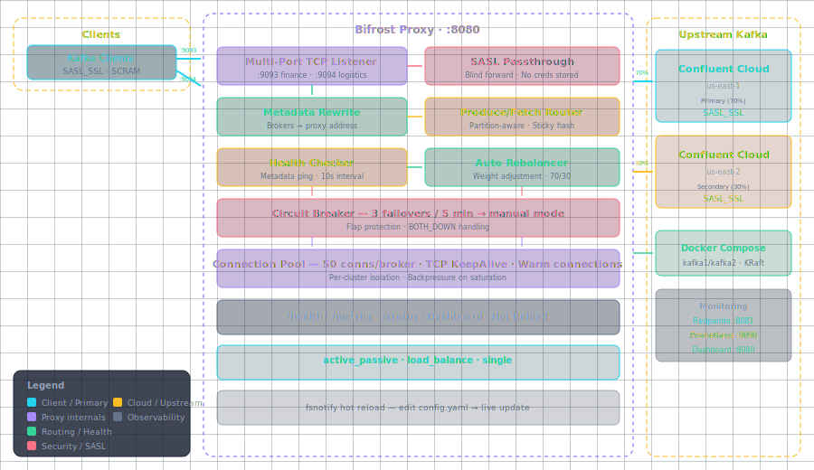
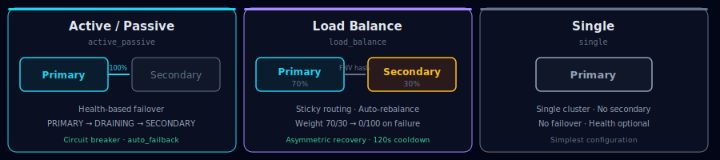

<p align="center">
  
</p>

# Bifrost — Kafka L7 Proxy

> *"Route Kafka traffic across the nine realms."*

**Bifrost** is a lightweight, stateless **Layer-7 Apache Kafka proxy** written in Go. Routes Kafka protocol traffic using **port-based routing** — each BU gets its own port, zero client-side changes beyond `bootstrap.servers`.

## ✨ Features

| | |
|---|---|
| 🔌 **Port-Based Routing** | One port per BU. No TLS/SNI required. |
| 🔐 **SASL Passthrough** | Forwards SCRAM-SHA-512 and PLAIN credentials transparently. |
| 📝 **Metadata Rewrite** | Intercepts Metadata responses, rewrites broker addresses. |
| 🎛️ **Three Modes** | `active_passive` · `load_balance` · `single` |
| ❤️ **Health Checks** | SASL-authenticated Metadata pings with configurable thresholds. |
| 📈 **Live Dashboard** | Per-cluster health, records, bytes, failover events. |
| 🔥 **Hot Reload** | Edit `config.yaml` — picks up changes without restart. |
| 📡 **Prometheus** | `proxy_health_status` · `proxy_failover_total` · `proxy_connections_active` |

## 🏗️ Architecture

<p align="center">
  
</p>

## 🎛️ Cluster Modes

<p align="center">
  
</p>

## 🚀 Quick Start

```bash
# Start everything (Kafka + Bifrost + Redpanda + Prometheus)
docker compose up -d

# Produce
echo "hello bifrost" | kcat -P -b localhost:9094 \
  -X security.protocol=SASL_PLAINTEXT \
  -X sasl.mechanisms=PLAIN \
  -X sasl.username=admin -X sasl.password=admin-secret \
  -t logistics-topic

# Consume
kcat -C -b localhost:9094 \
  -X security.protocol=SASL_PLAINTEXT \
  -X sasl.mechanisms=PLAIN \
  -X sasl.username=admin -X sasl.password=admin-secret \
  -t logistics-topic -o beginning -e

# Dashboard
open http://localhost:8080
```

## 📊 Monitoring

| Service | URL |
|---------|-----|
| Bifrost Dashboard | http://localhost:8080 |
| Prometheus | http://localhost:9090 |
| Redpanda kafka1 | http://localhost:8081 |
| Redpanda kafka2 | http://localhost:8082 |

## ⚙️ Configuration

```yaml
proxy:
  bind_address: "0.0.0.0"
  metrics_port: 8080

clusters:
  # active_passive — DR failover
  finance:
    port: 9093
    mode: "active_passive"
    active: "primary"
    primary: "pkc-11111.us-east-1.aws.confluent.cloud:9092"
    secondary: "pkc-22222.us-east-2.aws.confluent.cloud:9092"
    health_check:
      enabled: true
      auto_failover: true
      auto_failback: false

  # load_balance — weighted distribution
  logistics:
    port: 9094
    mode: "load_balance"
    primary:
      bootstrap: "pkc-33333.us-east-1.aws.confluent.cloud:9092"
      weight: 70
    secondary:
      bootstrap: "pkc-44444.us-east-2.aws.confluent.cloud:9092"
      weight: 30
    health_check:
      enabled: true
      auto_rebalance: true

  # single — standalone cluster
  # legacy:
  #   port: 9095
  #   mode: "single"
  #   primary: "old-kafka.internal:9092"
```

## 📚 Documentation

| Doc | Description |
|-----|-------------|
| [Consumer Behavior](docs/consumer-behavior.md) | How consumers work with load balancing, failover, ordering, and deduplication |
| [Failover & Message Durability](docs/failover.md) | Adaptive health checks, detection windows, message loss risk, client config |

## 📁 Project Structure

```
bifrost-proxy/
├── cmd/proxy/              # Entry point
├── internal/
│   ├── config/             # YAML parsing, validation, hot reload
│   ├── protocol/           # Kafka wire protocol parser
│   ├── proxy/              # TCP listener, connection handler, routing
│   ├── routing/            # SASL, metadata, produce/fetch routing
│   ├── pool/               # Connection pool, leader cache
│   ├── health/             # Health check engine
│   ├── failover/           # State machine, controller, rebalance
│   ├── logger/             # Structured JSON logging
│   └── server/             # HTTP server + embedded dashboard
├── test/                   # Test scripts
├── assets/                 # Diagrams and branding
├── docker-compose.yml      # Full dev stack
├── Dockerfile              # Multi-stage build
└── config.example.yaml     # Example config
```

## 📄 License

MIT
